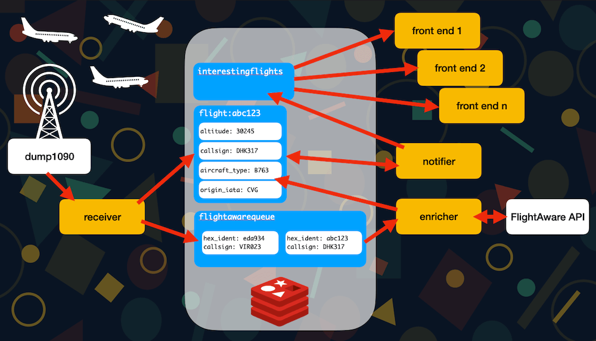

# Local Aircraft Tracker with Redis

This repository contains the code used for the Plane Spotting with Redis shows that are part of my [Things on Thursdays live streaming series](https://simonprickett.dev/things-on-thursdays-livestreams/).  This project decodes ADS-B messages received via an aerial and software defined radio USB stick, then stores them in Redis where they're enriched using additional data from the FlightAware API.  Flights that are deemed to be "interesting" (flown by a configurable set of aircraft types e.g. an Airbus A340 or a Boeing 747, and within a radius of my location) then have their details broadcast to interested front ends via Redis Pub/Sub and a Redis stream.

I made two example front ends for this project, the first being a Hanover displays flip dot sign that previously served on a bus that was scrapped...


If you want to hear the GIF demo above with glorious sound too, check out the [YouTube video](https://www.youtube.com/watch?v=iHm3GZCyKmE).  I wish GitHub would do proper embedding of YouTube videos in README files...

There's also an e-ink front end using a [Pimoroni Badger 2040W](https://shop.pimoroni.com/products/badger-2040-w)...


The Badger front end is written in [MicroPython](https://micropython.org/). All of the other components are written in [Node.js](https://nodejs.org/). See the "Project Overview" section for a run through of the architecture, or watch the start of the episode 5 or 6 videos for a animated recap.

## Watch the Videos

The videos for this project can be found on YouTube:

* Episode 1: [Project introduction, live coding the radio receiver component](https://www.youtube.com/watch?v=TCTej1uihG4).
* Episode 2: [Enriching the flight data with the FlightAware API](https://www.youtube.com/watch?v=Qu-_wvSJrdE).
* Episode 3: [Searching the data with Redis Stack's Search capability](https://www.youtube.com/watch?v=IEx2WgWdhIA).
* Episode 4: [Building the notifier component](https://www.youtube.com/watch?v=fYnrNqSgqR4).
* Episode 5: [Building a notification device with a flip dot sign](https://www.youtube.com/watch?v=i8grA5fsbdM).
* Episode 6: [Building a notification device with MicroPython and an e-ink display](https://www.youtube.com/watch?v=RROQA0QOq0k).

## Project Overview



If you prefer a video explanation, [click here](https://www.youtube.com/live/RROQA0QOq0k?feature=share&t=233) to watch one from the Episode 6 video :)

The project is organised as follows:

* An instance of [dump1090](https://github.com/antirez/dump1090) (third party project also written by Salvatore Sanfillipo who created Redis) runs and uses a USB stick software defined radio ([I have this one](https://www.radarbox.com/flightstick1090)) to receive and decode messages from passing planes.  The USB stick requires an aerial ([I have this one](https://www.ebay.co.uk/itm/284156504809?var=585644446714)).
* The receiver component receives messages from dump1090 by listening on a port.  It decodes these messages into JavaScript name/value pair objects and stores the data in a Redis Hash.  Each passing flight is identified using the aircraft transponder's hex ID.
* Once sufficient information about a given flight has been received (this may come in multiple separate messages), the receiver places the flight's callsign into a Redis List.  This acts as a queue between the receiver and enricher components.  The receiver stores the IDs of flights that were recently placed into the list as string values in Redis, setting a time to live on them.  This stops the receiver from asking the enricher about the same flight more than once in a given time period.
* The enricher component reads from the Redis List and uses the data in it to call the FlightAware API.  This returns more information about the flight than is available from just the radio messages, notably the aircraft operator code, origin and destination airports and the aircraft type.  The enricher writes this information into each flight's Redis Hash, "enriching" the data stored about the flight.
* There is a RediSearch index configured in the Redis Stack instance.  This monitors and indexes data in all Hashes whose key begins with `flight:`.  It allows us to write SQL like queries to find flights that match multiple criteria.  This is used by...
* The notifier component runs a search query periodically to find the latest "interesting" flights (ones that match a set of criteria for disance from me, aircraft type etc).  When it finds matching flights, it puts the details from the flight's Hash into a Redis Stream and also publishes them on a Redis Pub/Sub topic.  These can be used by front ends to the system to receive flight details to display.
* I implemented two different front ends for the system (so far, I may add more!):
  * Hanover Flip Dot Sign: TODO
  * Pimoroni Badger 2040W: TODO

## Running it Yourself

Almost all components of this project are written in Node.js.  They use features of JavaScript that require a recent version of Node.  I've tested them all with Node 16.15.1 on both macOS Ventura and Raspberry Pi OS (Debian 11 - "bullseye" version).

All of the components connect to a single [Redis Stack](https://redis.io/docs/stack/) database.  This is where they store data and communicate with each other in a variety of ways.

Get a free cloud hosted database [here](https://redis.com/try-free), or use the redis-stack Docker image ([here](https://hub.docker.com/r/redis/redis-stack)) or use the Docker compose file at the root of this repository.

It's also a good idea to download and install [RedisInsight](https://redis.io/docs/ui/insight/), a free tool for managing and visualising data in Redis.  Use this to see what's going on with your Redis Stack instance.

You'll find a README in the folder for each component that describes what it does and how to set it up.

The Badger2040W front end is the only component that doesn't use Node.js.  It is written in [MicroPython](https://micropython.org/).

## Example Search Queries from redis-cli

This project defines a [search index](https://redis.io/docs/stack/search/) over data in the flight Hashes in Redis.  Instructions for creating the index can be found with the receiver component's documentation.  To learn more about the index, [watch the Episode 3 video](https://www.youtube.com/watch?v=IEx2WgWdhIA&t=26s).

Here are some example queries that can be run using the Redis CLI (with or without RedisInsight)...

Which Easyjet (U2) Airbus 319 aircraft have we seen, and where were they going to/from?:

```
ft.search idx:flights "@operator_iata:{U2} @aircraft_type:{A319}" return 3 origin_name destination_name registration limit 0 2
```

Example response:

```
1) "9"
2) "flight:400E59"
3) 1) "origin_name"
   2) "Charles de Gaulle/Roissy"
   3) "destination_name"
   4) "Glasgow Int'l"
   5) "registration"
   6) "G-EZAW"
4) "flight:4010EB"
5) 1) "origin_name"
   2) "London Luton"
   3) "destination_name"
   4) "Inverness"
   5) "registration"
   6) "G-EZBW"
```

Whose Airbus A350-1000 or Boeing 787-9 aircraft have we seen?

```
ft.search idx:flights "@aircraft_type:{A35K|B789}" return 3 operator_iata registration aircraft_type
```

Example response:

```
1) "6"
2) "flight:A31A54"
3) 1) "operator_iata"
   2) "UA"
   3) "registration"
   4) "N29975"
   5) "aircraft_type"
   6) "B789"
4) "flight:C07B42"
5) 1) "operator_iata"
   2) "WS"
   3) "registration"
   4) "C-GURP"
   5) "aircraft_type"
   6) "B789"
6) "flight:407AF3"
7) 1) "operator_iata"
   2) "BA"
   3) "registration"
   4) "G-XWBI"
   5) "aircraft_type"
   6) "A35K"
8) "flight:407AF4"
9) 1) "operator_iata"
   2) "BA"
   3) "registration"
   4) "G-XWBK"
   5) "aircraft_type"
   6) "A35K"
10) "flight:40771A"
11) 1) "operator_iata"
   2) "VS"
   3) "registration"
   4) "G-VDOT"
   5) "aircraft_type"
   6) "A35K"
12) "flight:4077D3"
13) 1) "operator_iata"
   2) "VS"
   3) "registration"
   4) "G-VTEA"
   5) "aircraft_type"
   6) "A35K"
```

Which aircraft have passed within 20,000 metres of central Nottingham?  Return them sorted by distance, closest first.

```
ft.aggregate idx:flights "*" load 3 @position @operator_iata @flight_number filter "exists(@position)" filter "exists(@operator_iata)" apply "geodistance(@position, \"-1.148369,52.953150\")" as dist filter "@dist < 20000" sortby 2 @dist asc limit 0 3
```

Example response:

```
1) "102"
2) 1) "position"
   2) "-1.30989,53.01416"
   3) "operator_iata"
   4) "BA"
   5) "flight_number"
   6) "85"
   7) "dist"
   8) "12768.43"
3) 1) "position"
   2) "-1.30926,53.01676"
   3) "operator_iata"
   4) "AA"
   5) "flight_number"
   6) "135"
   7) "dist"
   8) "12888.89"
4) 1) "position"
   2) "-1.35093,53.02886"
   3) "operator_iata"
   4) "AC"
   5) "flight_number"
   6) "861"
   7) "dist"
   8) "15963.52"
```

Which aircraft are flying at 32,000ft or higher?

```
ft.search idx:flights "@altitude:[32000 +inf]" sortby operator_iata asc return 4 operator_iata destination_name aircraft_type altitude limit 0 3
```

Example response:

```
1) "29"
2) "flight:A80A8F"
3) 1) "operator_iata"
   2) "5X"
   3) "destination_name"
   4) "Cologne Bonn"
   5) "aircraft_type"
   6) "B748"
   7) "altitude"
   8) "37000"
4) "flight:405A48"
5) 1) "operator_iata"
   2) "BA"
   3) "destination_name"
   4) "George Best Belfast City"
   5) "aircraft_type"
   6) "A320"
   7) "altitude"
   8) "33225"
6) "flight:407464"
7) 1) "operator_iata"
   2) "BA"
   3) "destination_name"
   4) "Inverness"
   5) "aircraft_type"
   6) "A20N"
   7) "altitude"
   8) "36750"
```

What different types of aircraft are out there?

```
ft.aggregate idx:flights "*" load 1 @aircraft_type filter "exists(@aircraft_type)" groupby 1 @aircraft_type reduce count 0 as num sortby 2 @num desc limit 0 9999
```

Example response:

```
1) "18"
2) 1) "aircraft_type"
   2) "A320"
   3) "num"
   4) "16"
3) 1) "aircraft_type"
   2) "A319"
   3) "num"
   4) "10"
4) 1) "aircraft_type"
   2) "B738"
   3) "num"
   4) "7"
5) 1) "aircraft_type"
   2) "A20N"
   3) "num"
   4) "5"
6) 1) "aircraft_type"
   2) "A35K"
   3) "num"
   4) "4"
...
```

Find the closest "interesting" aircraft that passed by most recently since a given timestamp.  Interesting is defined as "it's a widebody aircraft, or some other types such as a 757".  Check out [Wikipedia's table of aircraft type codes](https://en.wikipedia.org/wiki/List_of_aircraft_type_designators).

```
ft.aggregate idx:flights "*" load 4 @__key @position @aircraft_type @last_updated filter "exists(@position)" filter "exists(@aircraft_type)" filter "@last_updated > 1677087696402" filter "@aircraft_type=='A124' || @aircraft_type=='A388' || @aircraft_type=='A35K' || @aircraft_type=='A359' || @aircraft_type=='A346' || @aircraft_type=='A345' || @aircraft_type=='A343' || @aircraft_type=='A342' || @aircraft_type=='A332' || @aircraft_type=='A333' || @aircraft_type=='A339' || @aircraft_type=='A337' || @aircraft_type == 'A310' || @aircraft_type=='A306' || @aircraft_type=='A30B' || @aircraft_type=='A3ST' || @aircraft_type=='B788' || @aircraft_type=='B789' || @aircraft_type=='B78X' || @aircraft_type=='B744' || @aircraft_type=='B748' || @aircraft_type=='B752' || @aircraft_type=='B753' || @aircraft_type=='B762' || @aircraft_type=='B763' || @aircraft_type=='B764' || @aircraft_type=='B772' || @aircraft_type=='B773' || @aircraft_type=='B77W' || @aircraft_type=='B77L'" apply "geodistance(@position, \"-1.148369,52.953150\")" as dist filter "@dist < 20000" sortby 2 @last_updated desc limit 0 1
```

Example response:

```
1) "102"
2) 1) "__key"
   2) "flight:405BFD"
   3) "position"
   4) "-1.30989,53.01416"
   5) "aircraft_type"
   6) "B772"
   7) "last_updated"
   8) "1677087696405"
   9) "dist"
   10) "12768.43"
```
