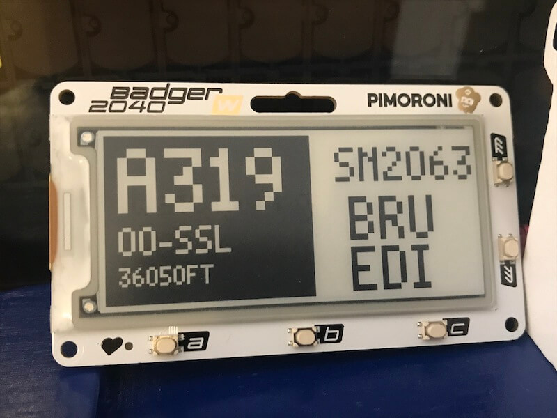

# Pimoroni Badger 2040W E-Ink Screen Front End Component

This is a front end for the local aircraft tracking project that uses the [Badger 2040W](https://shop.pimoroni.com/products/badger-2040-w) from [Pimoroni](https://shop.pimoroni.com/).  This is an all in one device that has a [Raspberry Pi Pico W](https://www.raspberrypi.com/documentation/microcontrollers/raspberry-pi-pico.html) built into it, along with an e-ink display, some buttons and a programmable LED.  Right now this project doesn't use the buttons or the LED, but I might extend it to do so in future.

The code for this component is written in [MicroPython](https://micropython.org/).  I used Pimoroni's build of MicroPython ([.uf2 files here](https://github.com/pimoroni/pimoroni-pico/blob/main/setting-up-micropython.md)) as it gives me access to their excellent [software libraries](https://github.com/pimoroni/badger2040) for working with the Badger and its screen.

**Full disclosure -** I didn't buy the Badger 2040W with my own money, it was given to me by Pimoroni to do some projects with.  However, I definitely recommend it, it's a great value all in one piece of kit!

## Setup

TODO

## Running the Front End

TODO
